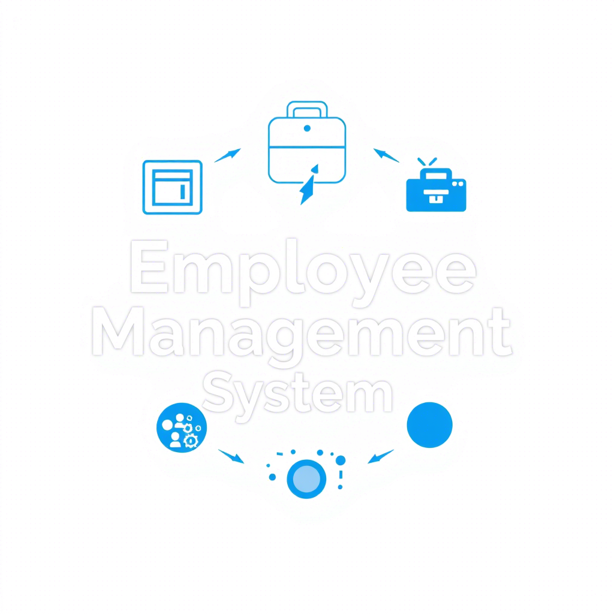

---

# 🚀 Projeto RAD Python




> O **Projeto RAD Python** é uma aplicação desenvolvida para demonstrar práticas de desenvolvimento ágil e eficiente em Python. Ele foi projetado para ser modular, fácil de usar e extensível.

---

Com base nas atualizações do sistema e nos módulos fornecidos, aqui está a versão atualizada do **Sumário**:

---

## 📋 Sumário

- [Sobre o Projeto](#sobre-o-projeto)
- [Estrutura dos Scripts](#estrutura-dos-scripts)
- [Pré-requisitos](#pré-requisitos)
- [Instalação](#instalação)
- [Como Usar](#como-usar)
  - [Script Principal (`main.py`)](#mainpy)
  - [Login (`login.py`)](#loginpy)
  - [Painel de Funcionário (`funcionario_module.py`)](#funcionario-modulepy)
  - [Painel do Administrador (`admin_module.py`)](#painel-do-administradorpy)
  - [Painel de RH (`rh_module.py`)](#painel-de-rhpy)
  - [Painel do Gestor (`gestor_module.py`)](#painel-do-gestorpy)
  - [Banco de Dados (`database.py`)](#databasepy)
- [Contribuição](#contribuição)
- [Colaboradores](#colaboradores)
- [Licença](#licença)

---

## 🌟 Sobre o Projeto

O **Projeto RAD Python** é uma aplicação desktop desenvolvida com Python e Tkinter, integrada a um banco de dados SQLite. Ele permite gerenciar funcionários e suas frequências, além de gerar relatórios detalhados sobre salários e horas trabalhadas. Este projeto é para implementar práticas de desenvolvimento ágil (RAD) em Python.

---

## 📂 Estrutura dos Scripts

O projeto é composto por:

1. **`main.py`**: Script principal que contém a interface gráfica e a lógica do sistema.
2. **`login.py`**: Módulo responsável pela autenticação de usuários.
3. **`funcionario_module.py`**: Módulo para funcionários e interações com o banco de dados.
4. **`gestor_module.py`**: Módulo para manutenção de frequência dos funcionários e interações com o banco de dados.
5. **`rh_module.py`**: Módulo para manutenção de funcionários e interações com o banco de dados.
6. **`admin_module.py`**: Módulo para manutenção de departamento e interações com o banco de dados.
7. **`database.py`**: Script principal da criação do banco de dados.

---

## 💻 Pré-requisitos

Antes de começar, verifique se você atendeu aos seguintes requisitos:

- **Python 3.x**: Certifique-se de ter instalado a versão mais recente do Python. Verifique com:
  ```bash
  python --version
  ```
  Ou, dependendo da sua configuração:
  ```bash
  python3 --version
  ```

- **Dependências**: Instale as bibliotecas necessárias usando o `pip`:
  ```bash
  pip install tkinter sqlite3 tkcalendar
  ```

- **Banco de Dados SQLite**: O arquivo `empresa.db` será criado automaticamente ao executar o sistema pela primeira vez. Certifique-se de que a pasta do projeto tenha permissão de escrita.

---

## 🚀 Instalação

Para instalar e configurar o **Projeto RAD Python**, siga estas etapas:

### Clonando o Repositório
```bash
git clone https://github.com/DaviMattosDev/projeto-rad-python.git
cd projeto-rad-python
```

### Instalando Dependências
```bash
pip install -r requirements.txt
```

### Executando o Sistema
Execute o script principal:
```bash
python main.py
```

---

## ☕ Como Usar

### **Script Principal (`main.py`)**
Este é o coração do sistema, onde a interface gráfica e a lógica principal estão implementadas.

#### Funcionalidades:
- **Login de Usuários**:
  - Insira o **Usuário** e **Senha** na tela inicial.
  - O sistema autentica o usuário com base nas credenciais armazenadas no banco de dados (`usuarios`).
  - Perfis disponíveis: `admin`, `funcionario`, `rh`, `gestor`.

- **Painel do Administrador**:
  - Acesso ao menu principal para gerenciar funcionários:
    - **Adicionar Funcionário**: Cadastre novos funcionários preenchendo os campos obrigatórios (nome, cargo, departamento, situação, data de início, senha). O sistema gera automaticamente um `username` no formato `nome.sobrenome` e define o perfil como `funcionario`.
    - **Listar Funcionários**: Exibe uma lista de todos os funcionários cadastrados, incluindo detalhes como ID, nome, cargo, departamento, situação e data de início.
    - **Registrar Frequência**: Permite registrar entrada ou saída para funcionários selecionados.
    - **Gerar Relatórios**: Exibe registros de frequência com detalhes sobre entradas e saídas.

- **Painel do Funcionário**:
  - Após login, o funcionário pode:
    - Registrar sua própria entrada e saída.
    - Visualizar boas-vindas personalizadas com base no nome completo.

- **Painel de RH**:
  - Gerenciamento avançado de funcionários:
    - **Cadastrar Funcionário**: Semelhante ao administrador, mas com foco em RH.
    - **Remover Funcionário**: Remova funcionários pelo ID ou username.
    - **Listar Funcionários**: Exibe todos os funcionários cadastrados.

- **Painel do Gestor**:
  - Ajuste de pontos:
    - Insira o `username` do funcionário para ajustar entradas ou saídas específicas.
    - Use o seletor de data e horário para definir o novo valor.
  - Geração de relatórios individuais:
    - Insira o `username` do funcionário para gerar um relatório detalhado com horas trabalhadas e status de cumprimento das 40 horas semanais.
    - O relatório pode ser salvo como um arquivo `.txt`.

#### Navegação:
- Use a **barra de rolagem vertical** à direita para navegar pelo conteúdo, caso ele ultrapasse o espaço visível.

---

### **Login (`login.py`)**
Este módulo é responsável pela autenticação de usuários.

#### Como Funciona:
- O sistema verifica as credenciais inseridas na janela de login.
- Exemplo de credenciais válidas:
  - **Usuário**: admin
  - **Senha**: senha_admin (ou qualquer senha previamente configurada e hashada).

#### Personalização:
- Novos usuários podem ser adicionados diretamente no banco de dados (`sistema.db`) ou cadastrados via interface (no caso de funcionários).
- Senhas são armazenadas no banco de dados como hashes SHA-256 para maior segurança.

---

### **Gerenciamento de Funcionários (`rh_module.py`)**
Este módulo gerencia as operações relacionadas aos funcionários e ao banco de dados.

#### Funcionalidades:
- **Cadastro de Funcionários**:
  - Insira o nome, cargo, departamento, situação e data de início.
  - Defina uma senha para o funcionário. O sistema gera automaticamente o `username` no formato `nome.sobrenome` e associa o perfil `funcionario`.
  - O cadastro inclui a criação de um registro na tabela `funcionarios` e um registro correspondente na tabela `usuarios`.

- **Atualização/Exclusão de Funcionários**:
  - A exclusão pode ser feita pelo ID ou `username` (via painel de RH).
  - Atualizações devem ser realizadas diretamente no banco de dados ou por meio de novas funcionalidades no futuro.

#### Banco de Dados:
- O módulo interage diretamente com o banco de dados SQLite (`sistema.db`) para realizar operações CRUD (Create, Read, Update, Delete).
- Tabelas principais:
  - `funcionarios`: Armazena informações dos funcionários (ID, nome, cargo, departamento, situação, data de início, senha).
  - `usuarios`: Armazena credenciais de login (ID, username, senha hash, perfil, funcionario_id).
  - `frequencia`: Registra entradas e saídas dos funcionários.

---

### **Ajustes de Pontos (`gestor_module.py`)**
Este módulo permite que gestores ajustem os pontos de funcionários.

#### Funcionalidades:
- **Buscar Funcionário**:
  - Insira o `username` do funcionário para carregar seus registros de frequência mais recentes.
- **Ajustar Entrada/Saída**:
  - Selecione o tipo de ajuste (entrada ou saída).
  - Use o calendário e os seletores de horário para definir o novo valor.
  - Salve o ajuste para atualizar o último registro de frequência do funcionário.

#### Relatórios Individuais:
- Gere relatórios detalhados com base no `username` do funcionário.
- O relatório inclui:
  - Entradas e saídas registradas.
  - Horas trabalhadas totais.
  - Status de cumprimento das 40 horas semanais.
- O relatório pode ser exportado como um arquivo `.txt`.

---

### **Segurança e Confiabilidade**
- **Hash de Senhas**: Todas as senhas são armazenadas como hashes SHA-256 para proteger as credenciais dos usuários.
- **Validação de Dados**: O sistema valida todos os campos antes de salvar no banco de dados, garantindo consistência.
- **Mensagens de Erro**: Mensagens claras orientam o usuário em caso de falhas ou inconsistências.

---

### **Próximos Passos**
- Implementar recuperação de senha para usuários.
- Adicionar suporte para exportação de relatórios em formatos como PDF ou Excel.
- Criar funcionalidade para ajustar múltiplos pontos simultaneamente no painel do gestor.

--- 

Essa documentação está alinhada com o estado atual do sistema e cobre todas as funcionalidades implementadas. 😊

---

## 🤝 Contribuição

Contribuições são bem-vindas! Para contribuir com o **Projeto RAD Python**, siga estas etapas:

1. Bifurque este repositório.
2. Crie um branch: `git checkout -b <nome_branch>`.
3. Faça suas alterações e confirme-as: `git commit -m '<mensagem_commit>'`.
4. Envie para o branch original: `git push origin projeto-rad-python/<local>`.
5. Crie a solicitação de pull.

Consulte a [documentação oficial do GitHub](https://help.github.com/en/github/collaborating-with-issues-and-pull-requests/creating-a-pull-request) para mais detalhes.

---

## 🙌 Colaboradores

Agradecemos às seguintes pessoas que contribuíram para este projeto:

<table>
  <tr>
    <td align="center">
      <a href="https://github.com/DaviMattosDev" title="Davi Mattos">
        <br>
        <sub>
          <b>Davi Mattos</b>
        </sub>
      </a>
    </td>
  </tr>
</table>

---

## 😄 Seja um dos Contribuidores

Quer fazer parte desse projeto? Leia o guia de contribuição em [CONTRIBUTING.md](CONTRIBUTING.md).

---

## 📝 Licença

Esse projeto está sob licença. Veja o arquivo [LICENSE.md](LICENSE.md) para mais detalhes.

---

